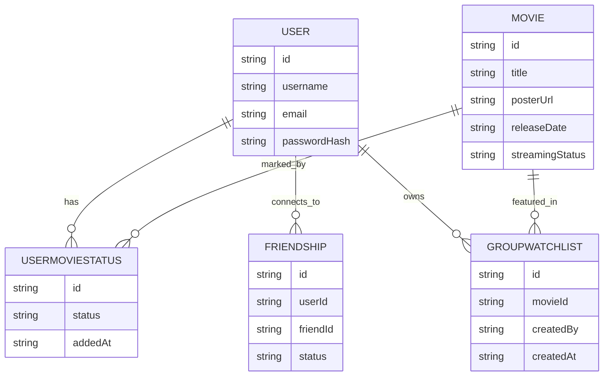

# READ ME for MOVIE SYNC (working title)

## 🎬 Project Overview

This project started as a way to keep track of which movies I wanted to watch with my siblings. After recently moving closer to my two sisters, we’ve made it a weekly tradition to either head to the theater or have a movie night at home. I wanted a simple and fun tool to track what each of us is excited to see, which movies we’re skipping, and make it easier to plan our next watch together.

The app lets users search for movies, mark their interest, and view a shared list that helps coordinate plans and keep the movie night hype going. Whether you're planning a theater outing or a cozy night in, this app is built to make movie decisions easier, and more fun.

## 💻 Potential App Description

This app is your all-in-one tracker for movies and shows—whether they're hitting theaters soon or already streaming. It’s built to make movie nights easy and fun to plan. Browse upcoming releases, mark what you're excited to watch, and see what your friends are into, too. Whether you're curating the perfect watchlist for a cozy night in, rallying the crew for a theater trip, or just checking out the latest buzz, this app keeps the fun going—and the group chat alive.

## Name suggestions

### 🎬 Fun & Catchy

- ReelTalk – A play on "real talk" and movie reels
- Popcorn Picks – Light, friendly, and movie-night themed
- The Watchlist – Simple, focused, and on point
- Coming Soonish – Playful and focused on hype and discovery
- FlickFam – Emphasizes the friend/family group element

### 🔍 Sleek & Modern

- CineSync – "Cinema" + "Sync" (great if you focus on syncing interests)
- FilmLoop – Suggests staying in the loop about new releases
- Marquee – Evokes old-school theaters, lights, and announcements
- ReelRadar – You’re tracking what’s coming soon and what your group’s watching
- SceneShare – About sharing excitement over scenes and screens

### 👯 Social & Collaborative

- MovieMood – Reflects what you’re in the mood to watch
- Let’s Watch – Friendly and collaborative
- WatchTogether – Emphasizes the shared experience
- MovieVibes – Casual, trendy, and community-driven
- HypeList – Taps into the energy of building excitement with friends

## ✨ Planned Features

- Search for Movies - Quickly look up movies by name and discover upcoming releases or titles already available for streaming or purchase.
- Personal Movie List - Add movies to your personal list and label them based on your interest: like "Excited to Watch", "Not Interested", or "Maybe Later"
- See What Others Are Watching - Compare your list with your family or friends to see which movies everyone's hyped for, helping you plan group outings or movie nights.
- Shared Watchlist View - A combined view that shows everyone's picks in one place, making it easy to find overlap and choose what to watch next.
- Built for Movie Nights - Whether you're going out or staying in, the app helps streamline planning and keeps the fun of movie night front and center.
- Clean, Responsive UI - Designed to be simple, fast, and easy to use on both desktop and mobile.
- Recommendations based on what is popular, and also recommendations based on your picks
- Track TV shows and the episodes you have seen

## 📝 Functional Requirements

### Users

- Can create an account and log in/out
- Can search for movies via TMDB
- Can mark a movie as:
  - Excited to See
  - Already Seen (Would you see it again? Seen it, never again / Seen it, would watch again)
  - Not interested
  - Maybe Later
- Can view their own movie list
- Can view other user's movie lists
- Can compare lists with other users

### Social Features

- Add/Connect with friends (via email or username)
- Compare watchlists (see overlapping interests)
- Add shared movies to a "Group Watch" list
- Comment on other user's movie choices
- Share movie listings with other users or outside of the app

### Optional/Nice-to-Have

- Mark if a movie is streaming, in theaters, or coming soon
- Link out to trailers or where to watch
- Create themed lists (e.g. "Girls Night)

## 💡User Stories

As a user...

- I want to log in so I can save my movie preferences
- I want to search for movies so I can quickly add them to a list
- I want to mark movies I want to see as "Excited to watch"
- I want to mark movies I do not want to see as "Not interested"
- I want to search for users so I can find my friends and connect
- I want to see what movies I have in common with my friends so we can plan together
- I want to sort or filter by genre or release status to understand what movies are available
- I want to be able to mark something that is on my watch list as “seen, watch again” or “seen, never again”

## 💬 Personal Goals

- Practice full-stack web development using Next.js, Tailwind CSS, and TypeScript
- Deploy a real working app
- Learn how to plan, track, and build features like a real-world dev

## 🛠 Tech Stack

- Next.js (React-based framework)
- Tailwind CSS for UI
- TypeScript
- PostgreSQL or SQL Server (via Azure)
- TMDB API for movie data
- Auth (NextAuth or Clerk)
- Vercel for deployment

## 🧰 Development Tools

- Visual Studio Code / Cursor.ai for code editing
- ChatGPT for architectural brainstorming, planning, and copywriting assistance
- Postman for API testing
- Git + GitHub for version control

## 🛣️ Roadmap (To be determined once requirements are fleshed out)

## 🗃️ Data Models (Schema Design)

### User

```typescript
{
  id: string
  username: string
  email: string
  passwordHash: string (if using own auth)
  createdAt: Date
}
```

### Movie

```typescript
{
  id: string // TMDB ID
  title: string
  posterUrl: string
  releaseDate: string
  streamingStatus: "in_theaters" | "streaming" | "coming_soon"
  genreIds: number[]
}
```

### TV Show

```typescript
{
  id: string // TMDB ID
  title: string
  posterUrl: string
  releaseDate: string
  streamingStatus: "in_theaters" | "streaming" | "coming_soon"
  genreIds: number[]
}
```

### UserMovieStatus

```typescript
{
  id: string
  userId: string
  movieId: string
  status: "excited" | "not_interested" | "maybe_later" | "seen_never_again" | "seen_watch_again"
  addedAt: Date
}
```

### Friends

```typescript
{
  id: string
  userId: string
  friendId: string
  status: "pending" | "accepted"
  requestedAt: Date
}
```

### GroupWatchList

```typescript
{
  id: string
  createdBy: string
  movieId: string
  participantIds: string[]
  comment?: string
  createdAt: Date
}
```



## 🖼️ Design inspiration


